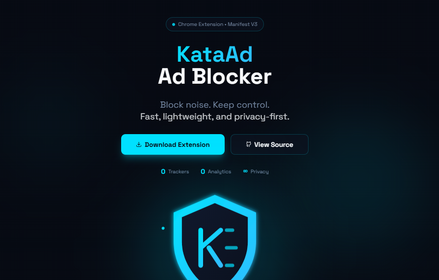
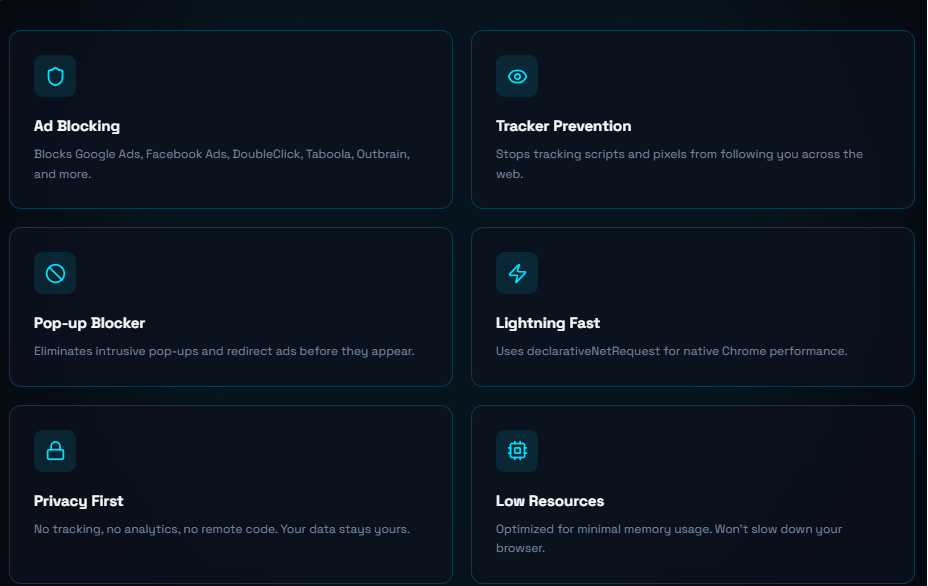
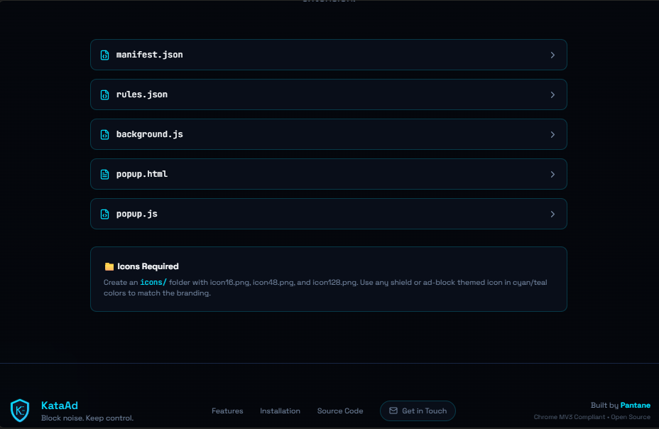
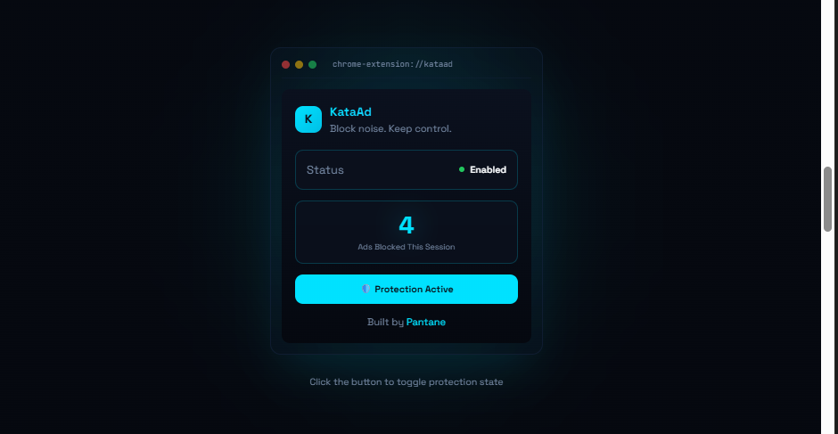
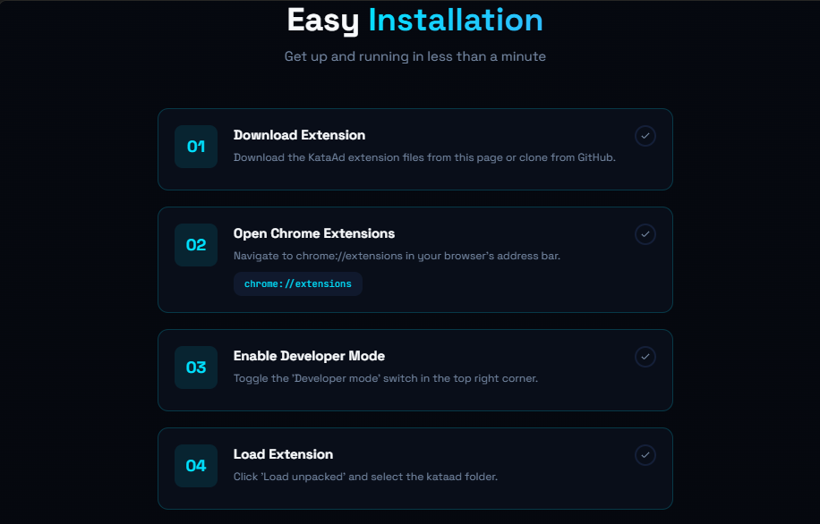

# KataAd – Lightweight Ad Blocker Extension

**KataAd** is a fast, privacy‑first ad blocker built as a Chrome (Manifest V3) extension. It blocks intrusive ads, trackers, and pop‑ups using Chrome’s native `declarativeNetRequest` engine for maximum performance and minimum resource usage.

**Tagline:** Block noise. Keep control.

---

## ✨ Key Features

* 🚫 Blocks common ads (Google Ads, Facebook Ads, DoubleClick, Taboola, Outbrain)
* 🕵️ Blocks trackers, pixels, and tracking scripts
* 🧠 Uses Chrome’s native MV3 `declarativeNetRequest` (no background interception)
* ⚡ Lightweight and fast (no remote filter lists)
* 🌙 Clean dark‑mode popup UI
* 🔁 Enable / Disable blocking with one click
* 📌 Persistent state using Chrome storage
* 📬 Built‑in **Get in Touch** page for developer contact

---

## 🧩 Extension Structure

```
kataad/
├── manifest.json
├── rules.json
├── background.js
├── popup.html
├── popup.js
├── contact.html
├── contact.js
├── icons/
│   ├── icon16.png
│   ├── icon48.png
│   ├── icon128.png
│   └── contact.png
```

---

## 🖥 Popup Interface

The popup provides a simple control panel:

* Extension name and status
* Toggle button to enable or disable ad blocking
* Footer navigation with **Get in Touch** button

Clicking **Get in Touch** opens an internal extension page with developer contact details.

---

## 📬 Get in Touch Page

The contact page is an internal, review‑safe extension page designed for transparency and support.

**Includes:**

* Developer name
* Email contact
* GitHub profile
* WhatsApp link

No tracking, no forms, no analytics.

---

## 🔒 Privacy & Security

KataAd is built with privacy as a first‑class principle:

* ❌ No user tracking
* ❌ No analytics
* ❌ No remote code execution
* ❌ No external filter subscriptions
* ✅ All logic runs locally in the browser

---

## 🛠 Installation (Developer Mode)

1. Clone or download this repository
2. Open Chrome and navigate to:

   ```
   chrome://extensions
   ```
3. Enable **Developer mode** (top‑right)
4. Click **Load unpacked**
5. Select the `kataad/` folder
6. KataAd will appear in your extensions list

---

## 🧪 Testing

To verify ad blocking:

* Visit a site known for ads
* Open DevTools → Network tab
* Observe blocked requests
* Toggle KataAd off and reload to compare

---

## 📦 Packaging for Chrome Web Store

1. Ensure all icons are present (16, 48, 128)
2. Validate `manifest.json` for MV3 compliance
3. Zip the contents of the `kataad/` folder
4. Upload via Chrome Web Store Developer Dashboard

---

## 🧭 Roadmap

Planned and optional upgrades:

* Per‑site allowlist
* Report broken site workflow
* Expanded ruleset (EasyList‑style)
* Firefox version (Manifest v2 compatible)
* Usage statistics (local‑only)

 
## 📄 License

MIT License. Free to use, modify, and distribute.

---

Built with focus, simplicity, and control.

> incase of any issues,feel free to [contact us](https://pantane1.github.io/nf/)

**_All Hail to Pantane_**


<p align="center">
  <a href="#">
</p>

<p align="center">
  <a href="#">
</p>


